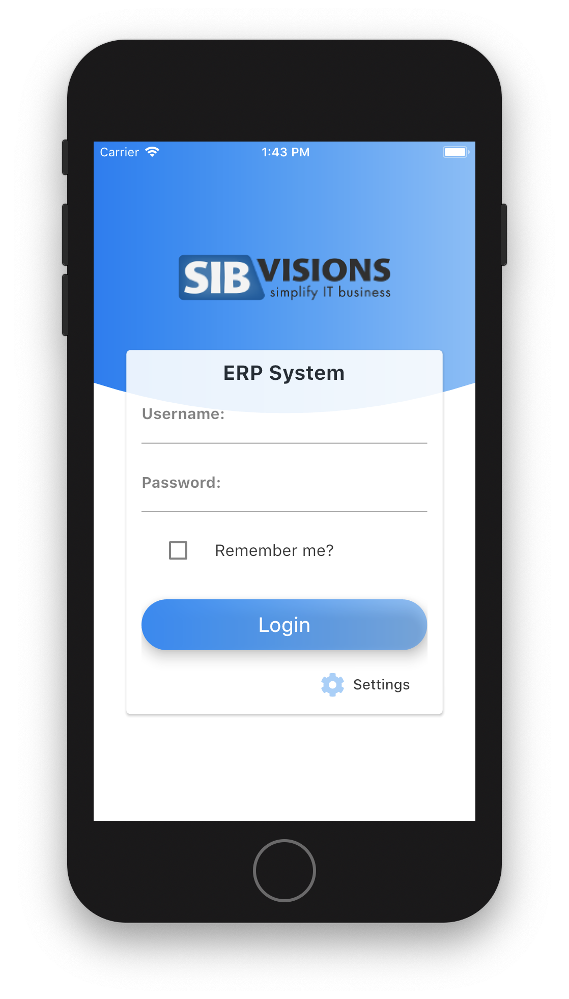
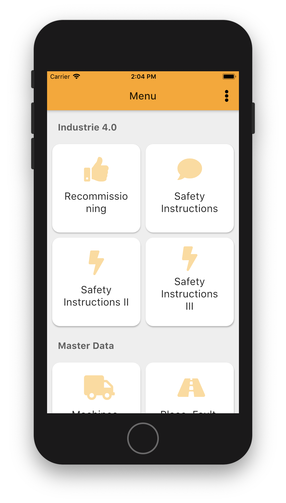
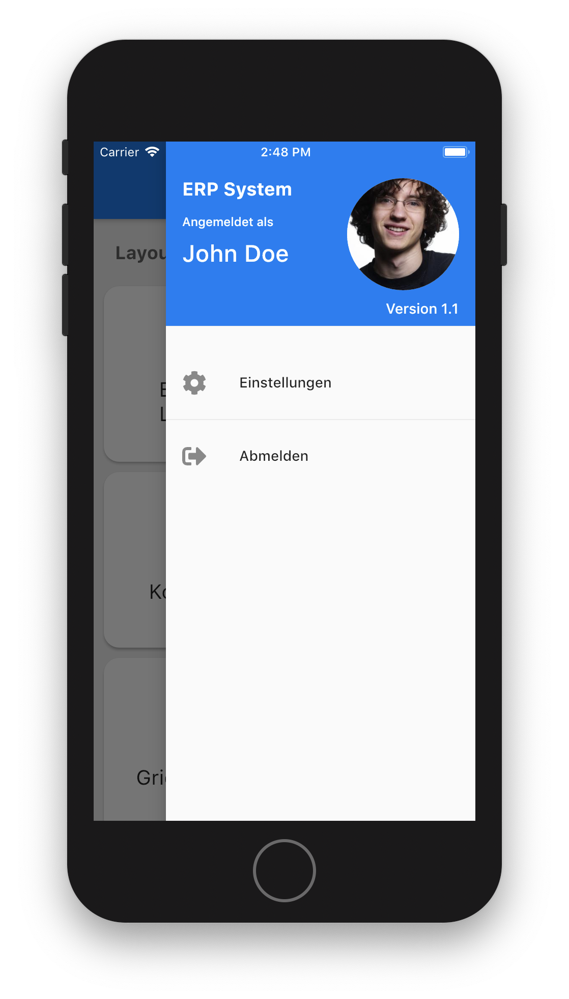
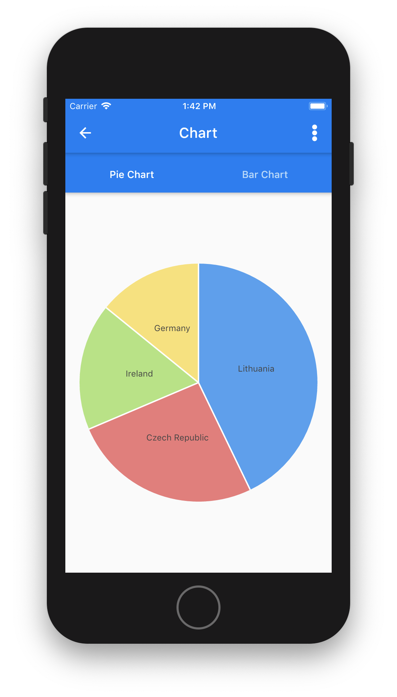
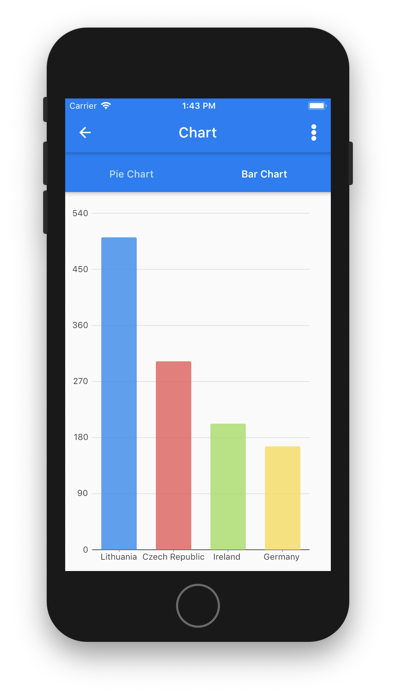
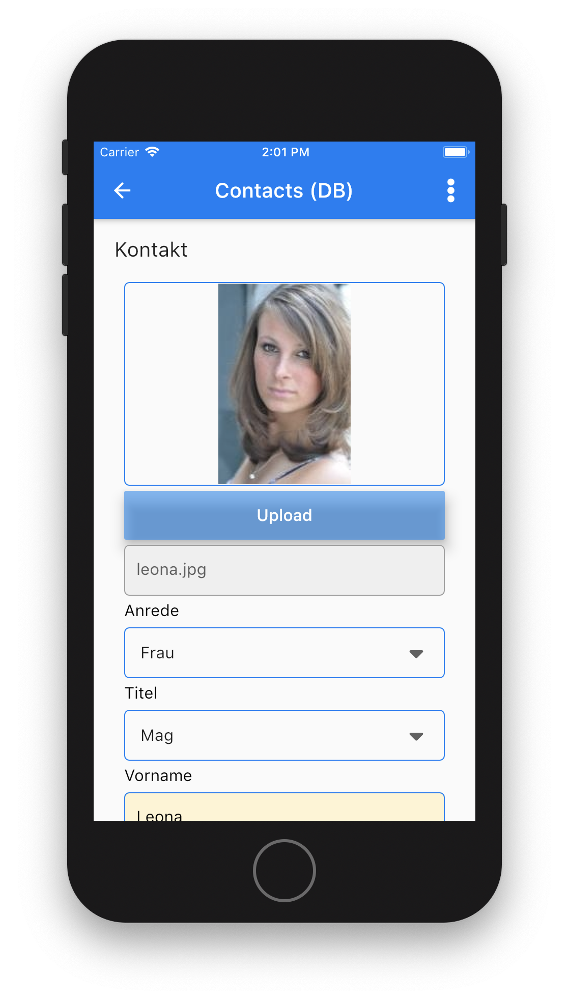

# Example Flutter Client

This example application demonstrates using the [FlutterClient](https://github.com/sibvisions/flutterclient) as external library. The app will add custom screens and will use other external libraties to demonstrate the full power.

## Getting Started

* Clone the repository
* Change the config (lib/main.dart)
* Run the app

## Customizing

The client uses a custom screen manager. It is defined in main.dart as screenManager property. The implementation can be found in ExampleCustomScreenManager class. The screen manager is responsible for menu customizing and for opening custom screens.

The example implementation adds a three new screens to the menu:

* Hello Custom Screen
* Telephone Call Screen
* Map Custom Screen

and changes the existing

* Charts

screen. 

The new screens are simple Flutter widgets and don't use the JVx API. The Charts screen uses the JVx API to retrieve data from the remote server and shows custom chart widgets.

## Dependencies

The example application uses [FlutterClient](https://github.com/sibvisions/flutterclient). So be sure that you upgrade the depencies from time to time:

``flutter pub upgrade``

## Preview

      
