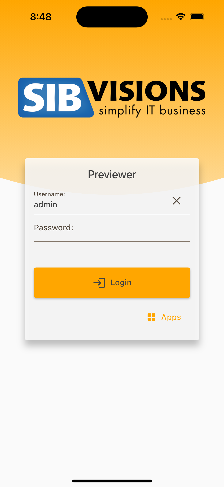
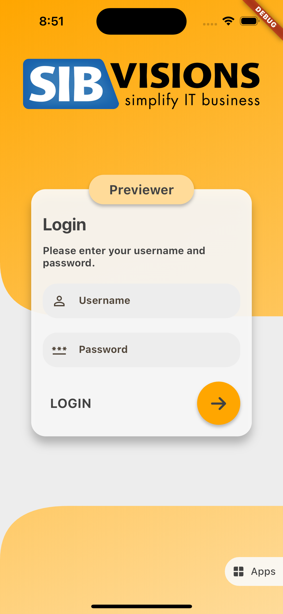
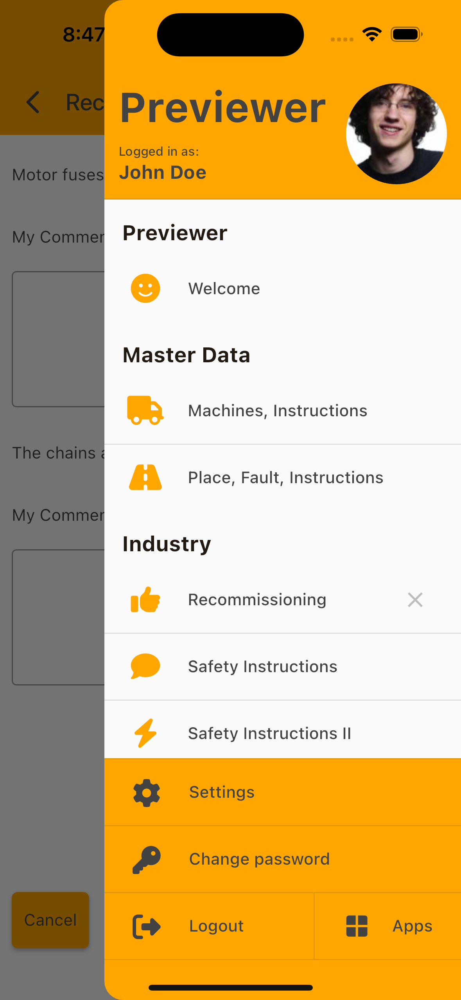
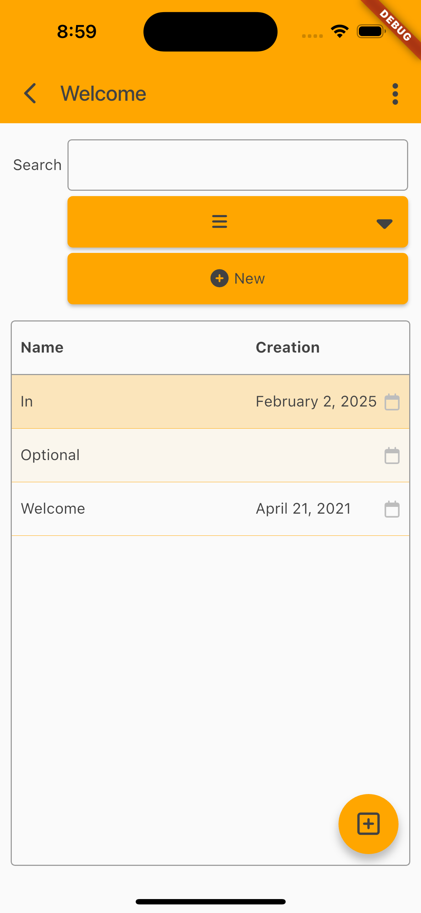
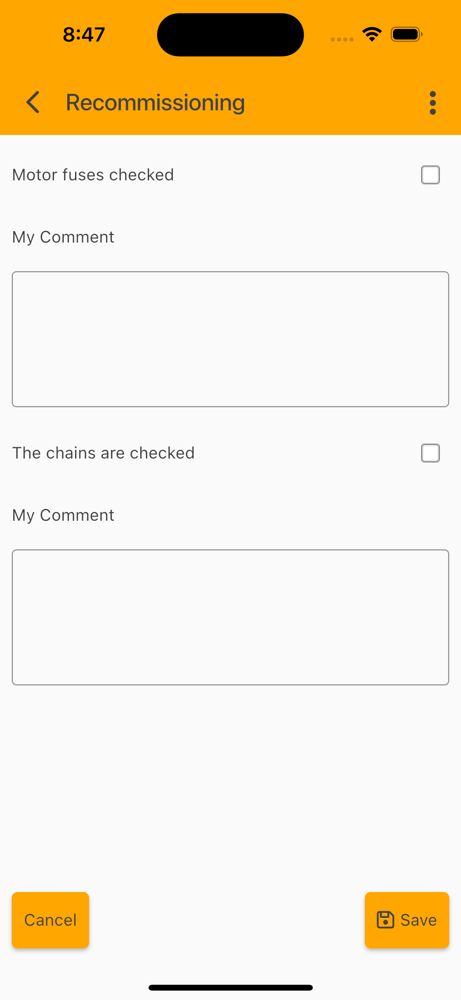

# Example Flutter JVx Client

This example application demonstrates using the [Flutter JVx Client](https://github.com/sibvisions/flutter_jvx) as external library. The app will add custom screens and will use other external libraries to demonstrate the full power.

## Getting Started

* Clone the repository
* Change the config (lib/main.dart)
* Run the app

## Customizing

The client uses a custom screen manager. It is defined in [main.dart](https://github.com/sibvisions/flutter_jvx.example/blob/main/lib/main.dart) as screenManager property. The implementation can be found in [ExampleCustomScreenManager](https://github.com/sibvisions/flutter_jvx.example/blob/main/lib/screen_manager.dart) class. The screen manager is responsible for menu customizing and for opening custom screens.

The example implementation adds a new screens to the menu:

* [Hello Custom Screen](https://github.com/sibvisions/flutter_jvx.example/blob/main/lib/widgets/hello_custom_widget.dart)
* [Telephone Call Screen](https://github.com/sibvisions/flutter_jvx.example/blob/main/lib/widgets/telephone_call_custom_widget.dart)
* [Map Custom Screen](https://github.com/sibvisions/flutter_jvx.example/blob/main/lib/widgets/map_custom_widget.dart)
* [QR Scan Screen](https://github.com/sibvisions/flutter_jvx.example/blob/main/lib/widgets/scanner_custom_widget.dart)
* [User Info Screen](https://github.com/sibvisions/flutter_jvx.example/blob/main/lib/widgets/user_data_custom_widget.dart)

and changes existing screens

* [Charts Screen](https://github.com/sibvisions/flutter_jvx.example/blob/main/lib/widgets/chart_custom_widget.dart)
* [Calender Screen](https://github.com/sibvisions/flutter_jvx.example/blob/main/lib/widgets/calendar_custom_widget.dart)
* [Signature Screen](https://github.com/sibvisions/flutter_jvx.example/blob/main/lib/widgets/signature_custom_widget.dart)
* [Styled Table Screen](https://github.com/sibvisions/flutter_jvx.example/blob/main/lib/widgets/styled_table_custom_widget.dart)
* [Contacts Screen](https://github.com/sibvisions/flutter_jvx.example/blob/main/lib/screens/contact_custom_screen.dart)

All new screens are standard Flutter widgets and don't use the JVx API.
The changed screens use JVx API to retrieve data from the backend (Chart, Calendar, Signature, Styled Table) or simply replaces some components/widgets (Signature, Contacts) Screen.

## Dependencies

The example application uses [Flutter JVx Client](https://github.com/sibvisions/flutter_jvx). So be sure that you upgrade the dependencies from time to time:

`flutter pub upgrade`

## Preview

    

## More Impressions

